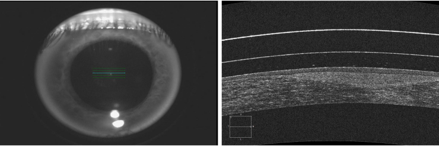

# Measuring cornea-contact lens ratio on AS-OCT 

Cornea problem is a common disease that can affect vision quality, it can be treated using contact lenses. 
However this tratment requires to analyse the cornea-lens ratio carefully using
Anterior Segment Optical Coherence Tomography (AS-OCT). 
For this proyect I used some computer vision techniques for solving this problem.

The picture dataset used in this project won't be included in this 
repo because it coresponds to a private dataset.

# Example images
Here is an example of an AS-OCT image. The left one coresponds
to a reference image and the right one the coresponding AS-OCT image. 

# Resources
Memoria.pdf includes a detailed implementation of this project (Spanish)

# Dependencies

* Python 3.x
* Opencv2
* Numpy 

    
